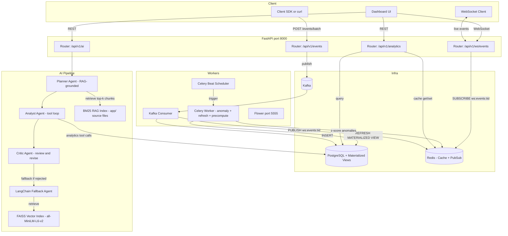
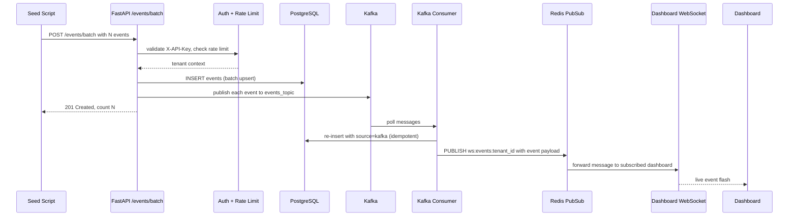
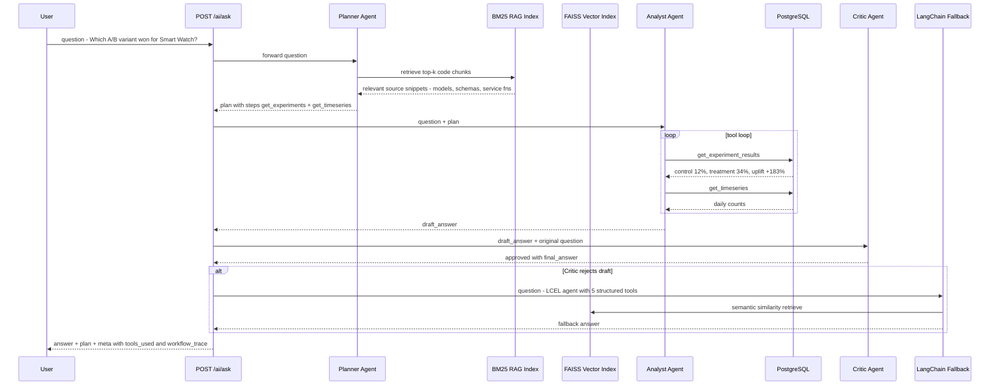
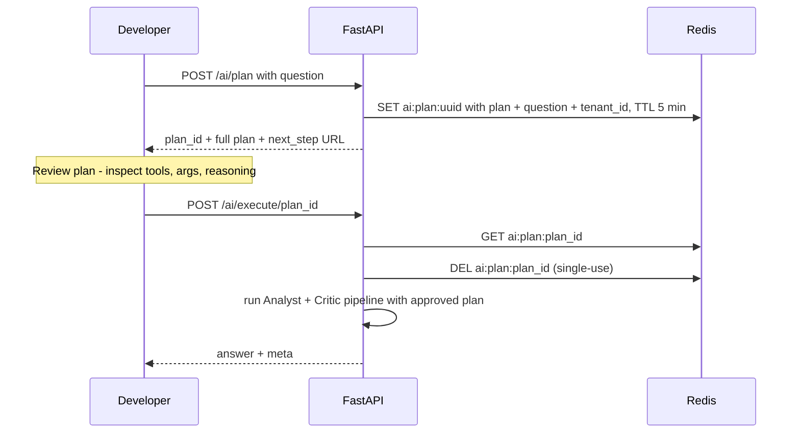

# Event Analytics Platform — Loom Walkthrough Script

**Target length:** 4 minutes  
**Format:** Screen recording with voiceover  
**Seed command:** `docker-compose run --rm api python -m app.seed`

---

## Diagrams

### 1. System Architecture



---

### 2. Event Ingestion Sequence



---

### 3. AI Query Pipeline (Multi-Agent + RAG)



---

### 4. HITL (Human-in-the-Loop) Flow



---

## Video Script

---

### [0:00 – 0:25] INTRO + ARCHITECTURE OVERVIEW

**Screen:** Architecture diagram (or just this repo in VS Code)

> "Hey, I'm going to walk you through an event analytics platform I built — it's a full-stack system designed around real-time e-commerce event ingestion, multi-tenant analytics, and an AI query layer backed by RAG over the codebase itself.
>
> The stack is FastAPI, PostgreSQL with materialized views, Redis for caching and pub/sub, Kafka for event streaming, Celery for background jobs, and a multi-agent AI pipeline using Groq with both BM25 and FAISS vector RAG indexes.
>
> Everything runs in Docker Compose — let me show you."

---

### [0:25 – 0:50] SERVICES RUNNING

**Screen:** Terminal — `docker-compose ps` or `docker-compose logs api --tail=30`

> "Services are already up. We've got the API, a Kafka consumer, a Celery worker, Celery Beat for scheduling, and Flower for task monitoring on port 5555.
>
> On startup, the API automatically builds two RAG indexes over all the Python source files — a BM25 keyword index and a FAISS semantic vector index. Those get used later by the AI planner to ground its reasoning in the actual codebase."

**Point at log lines:**
```
rag_index_built   chunks=142
vector_rag_index_built  chunks=142
```

---

### [0:50 – 1:15] THE DASHBOARD

**Screen:** Browser at `http://localhost:8000/dashboard`

> "Here's the live dashboard. It connects via WebSocket — every time a new event comes through Kafka, the consumer publishes it to a Redis pub/sub channel and the dashboard updates in real time.
>
> Right now it's empty because we haven't seeded any data yet. Let me fix that."

---

### [1:15 – 2:00] SEED SCRIPT — LIVE DATA

**Screen:** Split — terminal on the left, dashboard on the right

**Run in terminal:**
```bash
docker-compose run --rm api python -m app.seed
```

> "The seed script creates a demo tenant, generates 30 days of synthetic e-commerce event data — page views, product views, searches, add-to-cart, checkouts, and purchases — and sends it all via the batch events API.
>
> It models realistic signals: five traffic sources with different conversion multipliers, three device types, catalog gap searches that return zero results, and four controlled A/B experiments — a price discount on the Smart Watch, social proof reviews on Headphones, a cross-sell widget for the Yoga Mat, and a loyalty email for the Coffee Maker."

**Watch output scroll:**
```
Day -30: 45 sessions → 312 events
Day -29: 52 sessions → 387 events
...
Done — 14,208 events seeded.
```

**Flip to dashboard:**

> "And there it is — the dashboard just populated in real time as those events flowed through Kafka. We can see the event timeseries, top event types, and the tenant activity stream all live."

---

### [2:00 – 2:30] ANALYTICS ENDPOINTS

**Screen:** Browser at `http://localhost:8000/docs` — scroll through `/analytics` section

> "All the analytics queries are exposed as REST endpoints — summary stats, time series, funnel analysis, customer segmentation, basket co-purchase analysis, search gap detection, experiment results, traffic source conversion rates, and anomaly alerts.
>
> Anomaly detection runs on a Celery schedule every 5 minutes using z-score on hourly event counts — anything beyond 2.5 standard deviations from the 23-hour rolling baseline gets flagged per tenant in Redis."

**Click `/analytics/experiments` → Try it out → Execute**

> "Here are the A/B experiment results. You can see the Smart Watch discount treatment is converting at roughly 2.8x control — that's the data we just seeded."

---

### [2:30 – 3:30] AI QUERY WITH RAG

**Screen:** Swagger UI or terminal with curl — open `/ai/ask`

> "Now the interesting part — the AI layer. There are two types of queries this system handles."

**First query — analytics over live data:**

```bash
curl -s -X POST http://localhost:8000/api/v1/ai/ask \
  -H "X-API-Key: YOUR_API_KEY" \
  -H "Content-Type: application/json" \
  -d '{"question": "Which A/B experiment has the highest uplift, and what was the control vs treatment conversion rate for the Smart Watch discount?"}' | python -m json.tool
```

> "This goes through a three-agent pipeline: the Planner decides which tools to call and in what order, the Analyst executes those tool calls against the database in a loop, and the Critic reviews the draft answer for accuracy and completeness. If the Critic rejects it, the system automatically falls back to a LangChain agent."

**Point at response:**
```json
{
  "answer": "Experiment exp_001 (smart_watch_price_discount) shows the highest uplift...",
  "meta": {
    "tools_used": ["get_experiment_results", "get_timeseries"],
    "critic_approved": true,
    "workflow_trace": [...]
  }
}
```

**Second query — RAG over codebase source code:**

```bash
curl -s -X POST http://localhost:8000/api/v1/ai/ask \
  -H "X-API-Key: YOUR_API_KEY" \
  -H "Content-Type: application/json" \
  -d '{"question": "How does anomaly detection work in this codebase, and what z-score threshold does it use to flag an event?"}' | python -m json.tool
```

> "This one demonstrates something different — RAG over the codebase itself. The Planner agent retrieves the most relevant code chunks from the BM25 index before planning. So the AI is actually reading the detect_anomalies Celery task source code to answer the question — it knows the threshold is z > 2.5, the 23-hour rolling baseline window, the minimum mean of 3 events to avoid noise — all directly from the code."

---

### [3:30 – 3:55] HITL FLOW (OPTIONAL — SKIP IF SHORT ON TIME)

**Screen:** Swagger UI — `/ai/plan` then `/ai/execute/{plan_id}`

> "For production use cases where you want a human to review the query plan before it executes, there's a two-phase Human-in-the-Loop flow. Phase one generates and stores the plan in Redis with a 5-minute TTL. You inspect the reasoning, the tools it chose, the args. Phase two executes it. The plan is single-use and tenant-scoped."

---

### [3:55 – 4:15] WRAP UP

**Screen:** Repo in VS Code — briefly pan over `app/` directory structure

> "To summarize: events come in via REST, publish to Kafka, get consumed into Postgres, and surface through analytics APIs and a live WebSocket dashboard. The AI layer sits on top with a RAG-grounded multi-agent pipeline — BM25 for keyword retrieval and FAISS for semantic search — both indexed over the project's own source files.
>
> The system is designed to be extensible — the analytics service already has hooks for funnel analysis, retention cohorts, and A/B experiment interpretation. Celery handles the background work: materialized view refresh, anomaly detection, nightly evaluation runs against the LLM-as-judge pipeline."

---

## Pre-Recording Checklist

- [ ] `docker-compose up -d` — all services healthy
- [ ] Note your API key from the seed output (or run seed in advance and copy key)
- [ ] Open `http://localhost:8000/dashboard` in browser
- [ ] Open `http://localhost:8000/docs` in a second tab
- [ ] Have terminal ready with the two `curl` commands above (replace `YOUR_API_KEY`)
- [ ] Set browser zoom to ~125% for readability
- [ ] If demoing the seed live, split terminal + browser side by side

## Suggested AI Demo Queries

**Analytics (exercises Analyst tool loop):**
```json
{"question": "Which A/B experiment has the highest uplift, and what was the control vs treatment conversion rate for the Smart Watch discount?"}
```

**RAG over codebase (exercises BM25 retrieval + code context):**
```json
{"question": "How does anomaly detection work in this codebase, and what z-score threshold does it use to flag an event?"}
```

**Bonus — LangChain agent path:**
```json
{"question": "What search queries are returning zero results and how many unique users searched for them?"}
```
